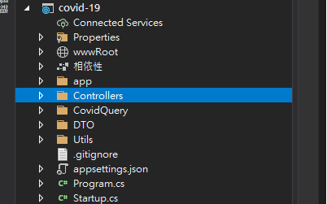
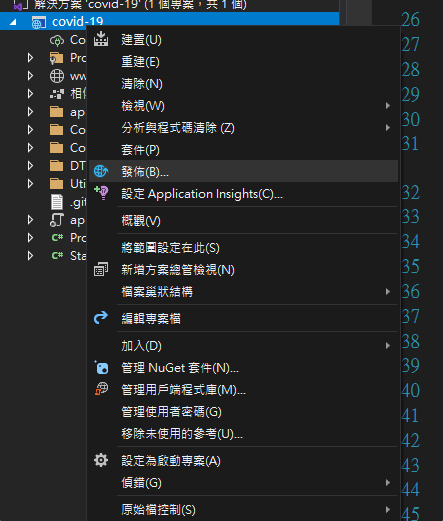
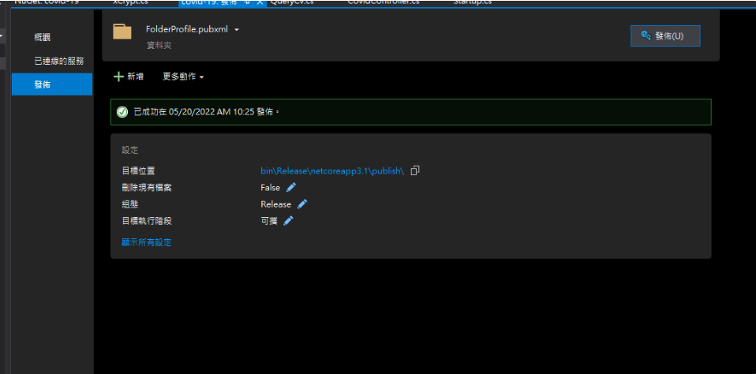

##### 專案範例使用：Asp.net core 3.1

#### **<font color='red'>1. 先在專案 底下 新增一個 wwwRoot 靜態資源資料夾(用於放打包好的前端)</font>**




**<font color='red'>wwwRoot 資料夾 用於放靜態資源 所以 樣子不一樣<font>**

<br>

#### **<font color='red'>2. 接下來在 Startup.cs(.net6 在 Program.cs) 添加設定 (套件:Microsoft.AspNetCore.SpaServices.Extensions)</font>**

```c#
app.UseHttpsRedirection(); //將 http 導向至 https
app.UseDefaultFiles(); // 沒有指定檔案名稱的話就預設使用 index.html  http://xxx.xxx.xx/controller/(index.html)
app.UseStaticFiles(); // 預設把  wwwRoot 資料夾底下的檔案作為靜態資源提供服務


// 404 not found
// 把後端收到的 /ORD/ORDWxxxx/app/.... 請求 全部導到 /ORD/ORDWxxx/app/index.html 靜態資源 並告訴前端 /a/b/c
app.UseSpa(spa => {
	spa.Options.SourcePath = "/app";
	});
```

<br>

#### **<font color='red'>3. 接下來 對專案 按下發佈 之後彈出畫面 在按發佈 會打包出新的包在 bin\Release\netcoreapp3.1\punlish( 裡面的東西就是要放置到 線上 )</font>**



