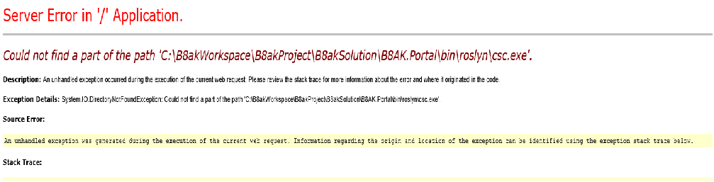
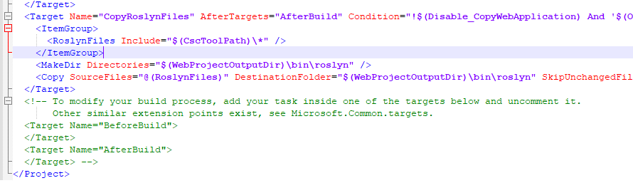

### 說明 : 會出現這個原因是因為新版開啟舊版專案導致




### 解決方法 :

- #### 1. 先到專案底下尋找 一個附檔名為  專案名稱.csporj
- #### 2. 然後在最下面貼上這段 到這裡面
- #### 3. 然後再重新執行一次 程式 就可以了
```C#
<Target Name="CopyRoslynFiles" AfterTargets="AfterBuild" Condition="!$(Disable_CopyWebApplication) And '$(OutDir)' != '$(OutputPath)'">
    <ItemGroup>
      <RoslynFiles Include="$(CscToolPath)\*" />
    </ItemGroup>
    <MakeDir Directories="$(WebProjectOutputDir)\bin\roslyn" />
    <Copy SourceFiles="@(RoslynFiles)" DestinationFolder="$(WebProjectOutputDir)\bin\roslyn" SkipUnchangedFiles="true" Retries="$(CopyRetryCount)" RetryDelayMilliseconds="$(CopyRetryDelayMilliseconds)" />
</Target>
``` 
<br>




