### **<font color='red'>說明：</font>**
**在 appsettings.json 自己所需要的參數 避免在邏輯控制層曝露自己的帳號密碼, 只有在邏輯控制啟動時注入 到 自己寫好的 DTO裡面 並且實例化**

<br>

### 第一種 抓取方法 IOption<T>
#### **<font color='red'>使用方法：</font>**

+  **1. 先在 appsettings.json 設定自己需要的 參數 例: 設定了一個 mysql 裡面的 connectionstring**

```json
"AllowedHosts": "*",
  "MySQL": {
      "ConnectionString": "server=127.0.0.1;userid=root;password=123456;database=django;"
  },
```

<br>

+  **2. 然後先寫好自己要注入的DTO**

```C#
namespace test2
{
	public class servermq
	{
		public string? ConnectionString { get; set; }
	}
}
```

<br>

+  **3. 然後在 Program.cs 裡面添加 這段 (基本上 appsettings.json 獲取裡面的資訊都是用這方式)**

```C#
builder.Services.Configure<servermq>(builder.Configuration.GetSection("MySQL"));
```

<br>

+  **4. 然後在 Controller 那裡 先幫 創好 一個變量 , 然後在他的建構函數下 添加這段.**

```C#
[ApiController]
[Route("[Controller]")]
public class UserController : Controller
{
	private readonly servermq _options;

	//建構函數
	public UserController(IOptions<servermq> options)
	{
		// 啟動時注入 並且把 值 賦予到 創好的變量裡面 
		_options = options.Value;
	}
}
```

<br>
<br>

### 第二種 擺脫 IOption，直接DI註冊組態物件(推薦)(範例版本:Asp.net 3.1)
#### **說明：**
- **消除對 IOptions 的依賴**
- **使用內建的 DI 直接註冊組態物件**
- **需要藉由 IConfiguration 介面所提供的 !Bind! 方法**

<br>

#### **教學：**
- **先在Models建立一個 application.json 接值使用的物件**
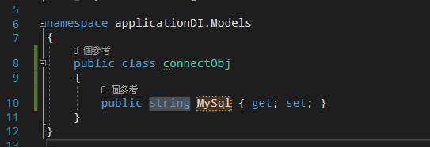

<br>

- **在 application.json 設置connectStr**
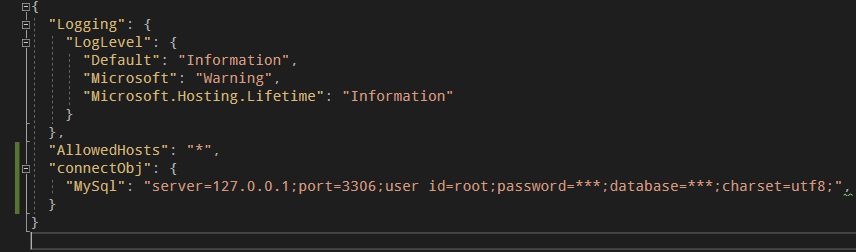

<br>

- **在 Startup.cs 的 ConfigureServices 設置**
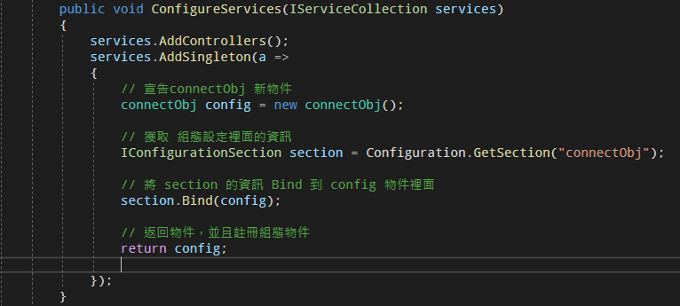

<br>

- **在 controller 取得註冊物件，並且回傳 MySql 的 connectStr**
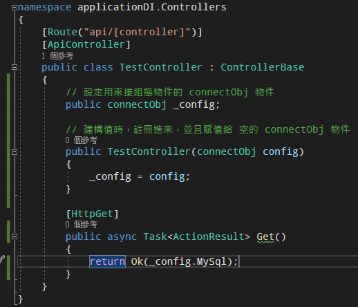

<br>

- **回傳結果，展示在頁面，正常都是在 controller 裡面使用**
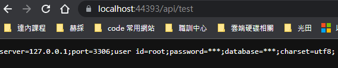

<br>
<br>

### 第三種 抓取方法 IConfiguration(範例版本:Asp.net 3.1)

- 一樣 先在 appsettings.json 裡面設置要獲取的值

<br>

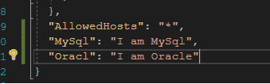

<br>

- 使用 IConfiguration 介面 去獲取 appsettings 裡面的資訊
- 預設一個空的 IConfiguration 
- 並且在建構值裡面 將 實體物件賦予給它

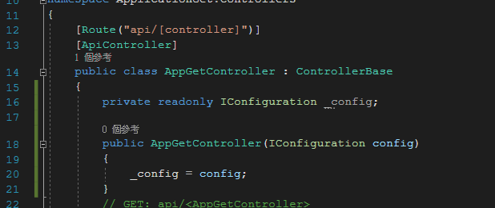

<br>

- 利用 鍵值對的方式去抓取

<br>

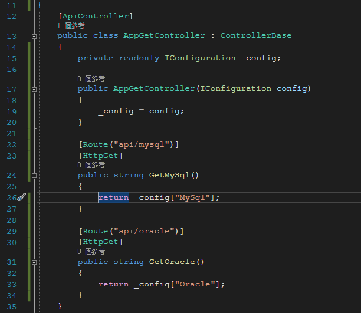

<br>

- 輸出結果

<br>

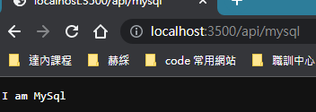

<br>
<br>

### 第三種方法延伸，官方默認 ConnectionStrings (範例版本:Asp.net 6)

- 先在 application.js 設置，官方默認 ConnectionStrings 這個命名用於存放 連線字串

<br>

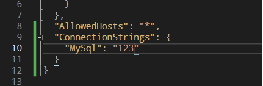

<br> 

- 再 Controller 裡面一樣建構值 將 IConfiguration 注入到 空的 設定好的 IConfiguration _config
- 由於照著官方有設置 ConnectionStrings 這個命名，便可以使用 IConfiguration 的 GetConnectionString 方法

<br>

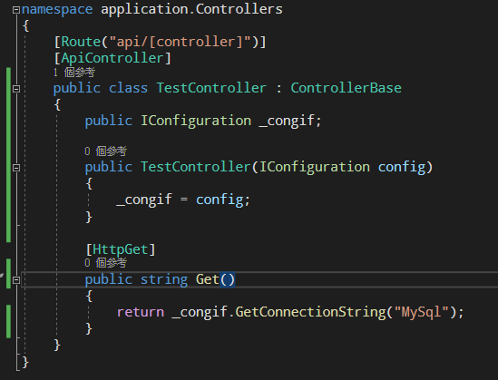

<br>

- 輸出結果，可以捕捉到 ConnectionStrings 底下寫的 MySql 的值

<br>

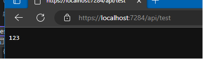


