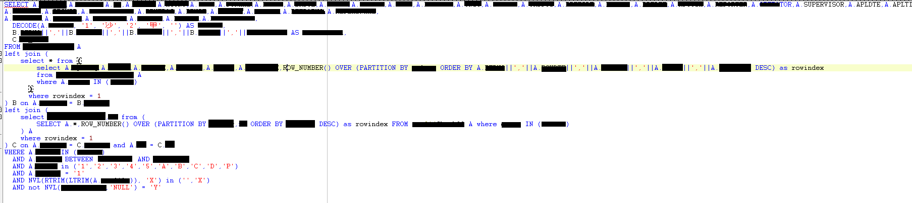

### 1. SQL 執行語句時 先後順序

 

**上面的圖片總共分四個區塊分別是：select 後面欄位、from 主表、where 條件、left join部分**

- **1. 資料庫運行時會先從 from 主表尋找資料，再來 where 條件找跟主表相關的做排除**
- **2. 再來 left join 部分，再來 where 條件找跟 left join 相關的做排除**
- **3. 最後才是 select 後面欄位的建置**

 

### 2. 部分觀念說明

- **在 join 另外一張表的時候，如果已有明確要尋找的條件，可以再 join裡面就做排除，不需要再帶不相關的資料近來，減少查詢次數，限縮資料範圍**

 

- **避免在 select 欄位區塊 做子查詢，查詢次數會已次方成長，並且造成查詢速度大幅度遞減，這意思就是 最後運行到建構 欄位 每一筆因為欄位裡面有做子查詢，等同於建構每一筆資料時都要做一次查詢。**
