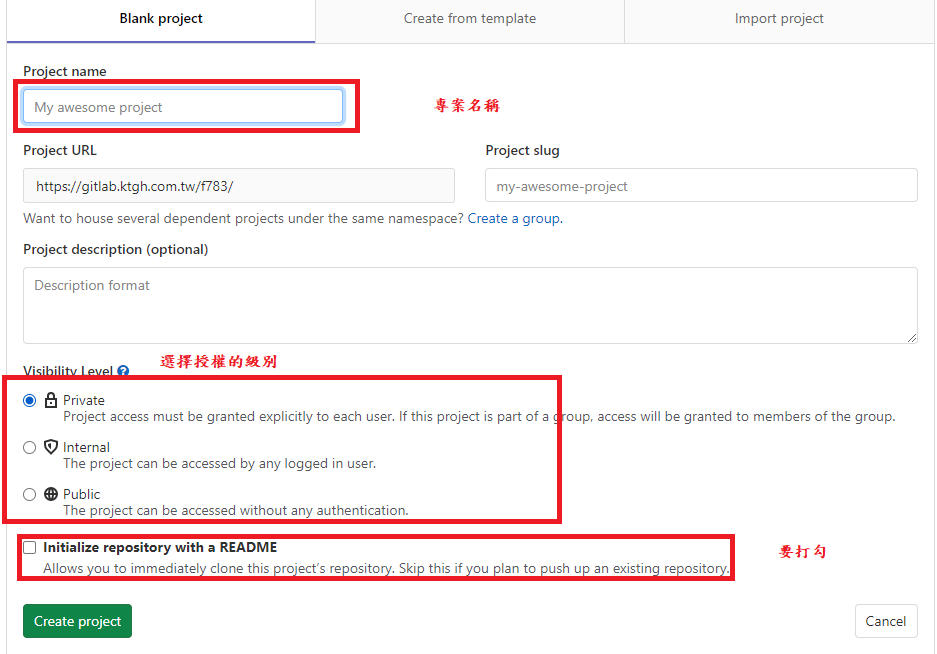
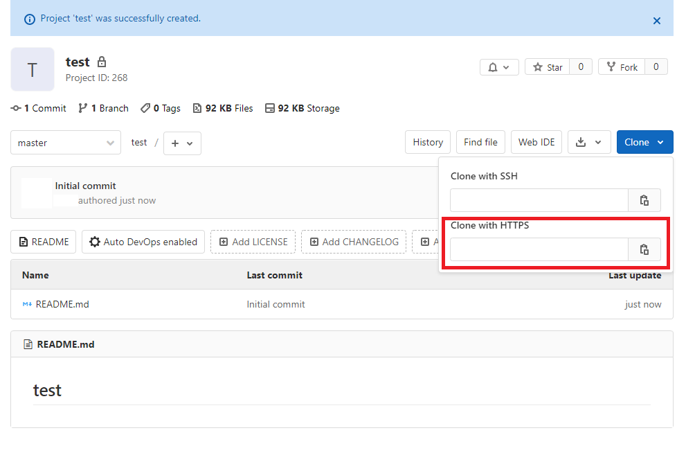

### 1. 說明 : 在使用之前 請先安裝完 git 這邊安裝方法就不再敘述

 <br>

### 2. 登入到自己的 gitlab 裡面 並且按 new project 進入到此頁面
 

<br>

### 3. 點擊 clone 並且複製上面 https 的網址


<br>

### 4. 回到 要上傳的專案  
- ##### 先初始化 git 本地倉庫 到專案的終端機上面 輸入這段指令
```bash
git init
```

<br>

- ##### 輸入這段指令，將所有檔案先加入到暫時存檔區
```bash
git add .   (. 的意思就是全部)
```

<br>

- ##### 提交版本 本次 加入到暫存區的 輸入這段指令
```bash
git commit -m "這邊是輸入備註，看是要輸入版本號或者是寫入此版本修改了甚麼都可以"
```

<br>

- ##### 接下來要利用 我們剛剛複製的 gitlab https 位置，輸入這段指令給它一個別名
```bash
git remote add [name] [your https url]
```

<br>

- ##### 然後就可以將專案 推到你的 遠程倉庫了
```bash
git push [url_name] [branch]
```

<br>

### 5. 就可以回到 gitlab 看看 創的 project 有沒有資料了!!!!   


