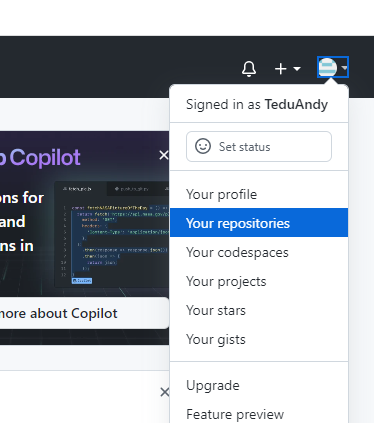
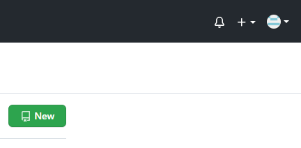
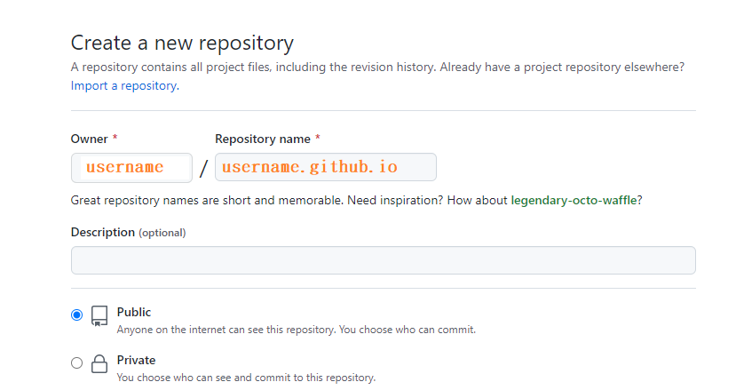
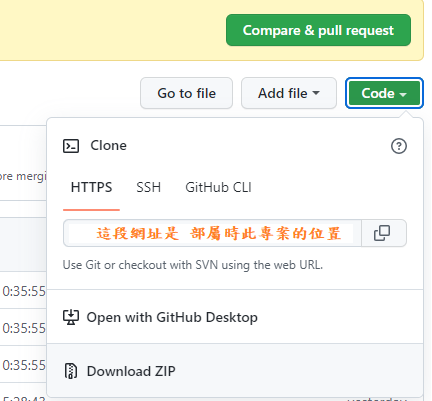

## GitHub 產生站點專案

#### <font color='e59911'>1. 先點 Github 官網跟著圖片點</font>

**第一步 點擊 repositories**
<br>


<br>

**第二步 點new 產生站點專案**
<br>


<br>

**第三步 在橘色文字那邊輸入 你的用戶名 + github.io 然後按 create repository**


<br>

**第四步 點擊 Your repositories 點選 剛創建的專案 點選 code 會得到 部屬會用到網址**


## hexo 專案 設置部分

#### <font color='e59911'>1. hexo 部屬前需安裝的套件</font>
```bash
npm install hexo-deployer-git --save
```

<br>

#### <font color='e59911'>2. 修改根目錄的_config.yml檔案</font>
```yml
# Deployment
## Docs: https://hexo.io/docs/one-command-deployment
deploy:
  type: "git" // 類別請寫 git
  repo: https://github.com/username/username.github.io.git // github專案位置
  branch: master  // 上傳到此專案的哪一個分支，通常都是 master 
```

<br>

#### <font color='e59911'>3. 輸入指令部屬上傳</font>

+ **每次部屬請進行三步驟**
```bash
hexo clean        // 清除之前建立的靜態檔案
hexo generate     // 建立靜態頁面
hexo deploy       // 部署至 GitHub
```