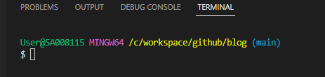
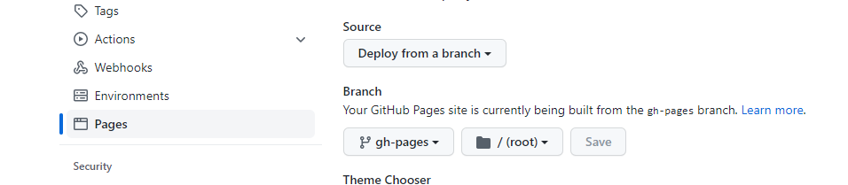

### **簡介：**

+ ##### **官網：[HUGO](https://gohugo.io/)**
+ **主題也可以從官網上面查找自己想要得主題**

<br>

**官網上的經典名句：The world’s fastest framework for building websites**
**這意思其實是指生產靜態資源的速度。**

**讓我們看看，可參考以下 Build Time 比較表 生產靜態資源的速度** [出處](https://forestry.io/blog/hugo-vs-jekyll-benchmark/)

|Generator|10    |100	|1,000	|10,000 |
| :-----: | :--: |:----:|:-----:|:----: |
|Hugo     |0.05s |0.08s	|0.34s  |2.95s  |
|Jekyll   |1.47s |3.3s  |14.38s |187.15s|

<br>
<br>

[大神-Blog](https://tigernaxojr.github.io/blog/#home)
**這邊創建專案的方式參考某位大神寫好的腳本，創建好的同時並且上傳到 github 上面之外，還在此專案上面分成兩個分支，一個是 main(負責放原本的專案位置)，一個是 gh-pages(存放Bulid過後的靜態資源)**

<br>

## **1. 設置腳本bash檔案**

##### **先在你想要存放的位置打開一個空白的txt檔案，然後把腳本放進去之後，副檔名修改成 .sh 的副檔名，記得要先在 github 先建立好 res 專案 以及腳本要進行設置，需設置的部分下面註釋有說。**

#### **腳本如下：**
```bash
#!/bin/bash
gitUser="" # 這邊設置 github 帳號
gitRepo="" # 這邊設置 respon 專案的 名字 
hugo new site ${gitRepo}
cd ${gitRepo}/
git init
git clone https://github.com/gurusabarish/hugo-profile.git themes/profile #這邊設置 需要使用到的主題的 github
rm -rf themes/profile/.git
cp -r themes/profile/exampleSite/* ./
#sed -i "1,1s=http://localhost:1313/=https://${gitUser}.github.io/${gitRepo}/=g" config.toml

echo "public" >> .gitignore

echo "#!/bin/bash" >>  run-commit-gh-pages.sh
echo "rm -rf public/" >> run-commit-gh-pages.sh
echo "hugo" >> run-commit-gh-pages.sh
echo "cd public && git add --all && git commit -m \"Publishing to gh-pages\" && cd .." >> run-commit-gh-pages.sh

echo "#!/bin/bash" >>  run-push-gh-pages.sh
echo "git push origin gh-pages" >> run-push-gh-pages.sh

chmod a+x run-commit-gh-pages.sh
chmod a+x run-push-gh-pages.sh


#if [ "`git status -s`" ]
#then
#    echo "The working directory is dirty. Please commit any pending changes."
#    exit 1;
#fi
#
#echo "Deleting old publication"
#rm -rf public
#mkdir public
#git worktree prune
#rm -rf .git/worktrees/public/
#
#echo "Checking out gh-pages branch into public"
#git worktree add -B gh-pages public origin/gh-pages
#
#echo "Removing existing files"
#rm -rf public/*
#
#echo "Generating site"
#hugo
#
#echo "Updating gh-pages branch"
#cd public && git add --all && git commit -m "Publishing to gh-pages (publish.sh)"
#
##echo "Pushing to github"
#git push --all

FILE="run_publish.sh"
cat > $FILE <<- EOF
if [ "\`git status -s\`" ]
then
    echo "The working directory is dirty. Please commit any pending changes."
    exit 1;
fi

echo "Deleting old publication"
rm -rf public
mkdir public
git worktree prune
rm -rf .git/worktrees/public/

echo "Checking out gh-pages branch into public"
git worktree add -B gh-pages public origin/gh-pages

echo "Removing existing files"
rm -rf public/*

echo "Generating site"
hugo

echo "Updating gh-pages branch"
cd public && git add --all && git commit -m "Publishing to gh-pages (run_publish.sh)"

#echo "Pushing to github"
git push --all
EOF
chmod a+x ${FILE}

git add .
git commit -m "first commit"
git branch -M main
git remote add origin https://github.com/username/respon.git # 這邊設置 respon專案 的 clone 網址

git checkout --orphan gh-pages
git reset --hard
git commit --allow-empty -m "Initializing gh-pages branch"
git push origin gh-pages
git checkout main

./${FILE}
```

<br>

## **2. 執行腳本**

**這邊需要會一點終端指令，打開 vs code 打開 TERMINAL 在右手邊 點選 + 新增一個 git bash，然後 cd  到 放置腳本的位置之後，輸入指令** 
```bash
bash ./腳本名稱.sh
```

<br>

**執行完之後，會在腳本同個位置產生出跟 github res 專案名稱一樣的專案資料夾，就可以針對自己設置好的主題進行修改了。** 

<br>

## **3. 專案資料夾修改後要如何重新發佈**

**新建完的專案進行新增文章後或者修改樣式後，要進行重新發佈，一樣需要利用腳本，但是新建的專案裡面 有增加三個副檔名為 .sh 的檔案，但是基本上我們只會運用到其中一個叫做 run_publish.sh，這個腳本，另外兩個可以刪除，避免搞混。**

#### **一樣也是 開啟 TERMINAL 的 git-bash的介面 cd 到此專案，要先確認 git-分支 是 main 如圖**


**確定好之後依序輸入 git 指令，這兩個去收尋 git 使用方式 就會理解，這邊不再額外敘述**
```bash
git add . 
git commit -m "save"
git status
```

**都輸入完之後，確認 git status 輸入完之後是否為空的就可以執行腳本，等他執行完就發佈成功**
```bash
bash ./run_publish.sh
```

## **4. github 當靜態資源站點 設置**
**到 github 切換到 你的res 專案裡面 點擊 Settings 再點擊 pages，會發現有一個 Branch 的設置**



**前面有提到新建專案並且同時發佈時，github 這邊會有兩個分支，一個負責儲存 原始專案，一個是負責放置 打包過後要發佈顯示的靜態資源，而 gh-pages 就是要負責當顯示的分支，切換成這個分支之後按儲存，這樣就可以從 https://username.github.io/res專案名稱 看到你的部落格了!!!!**